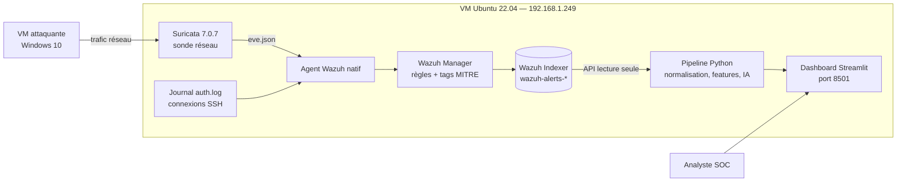
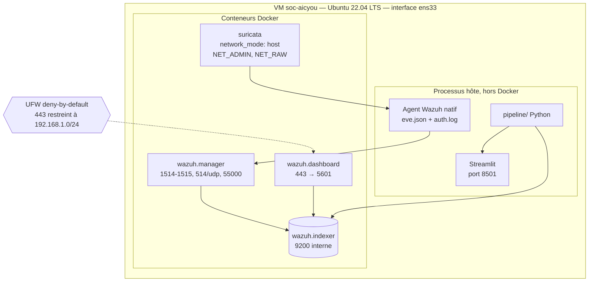
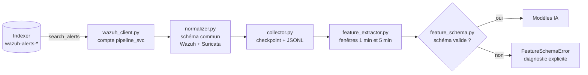
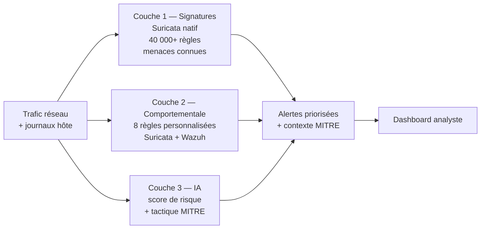
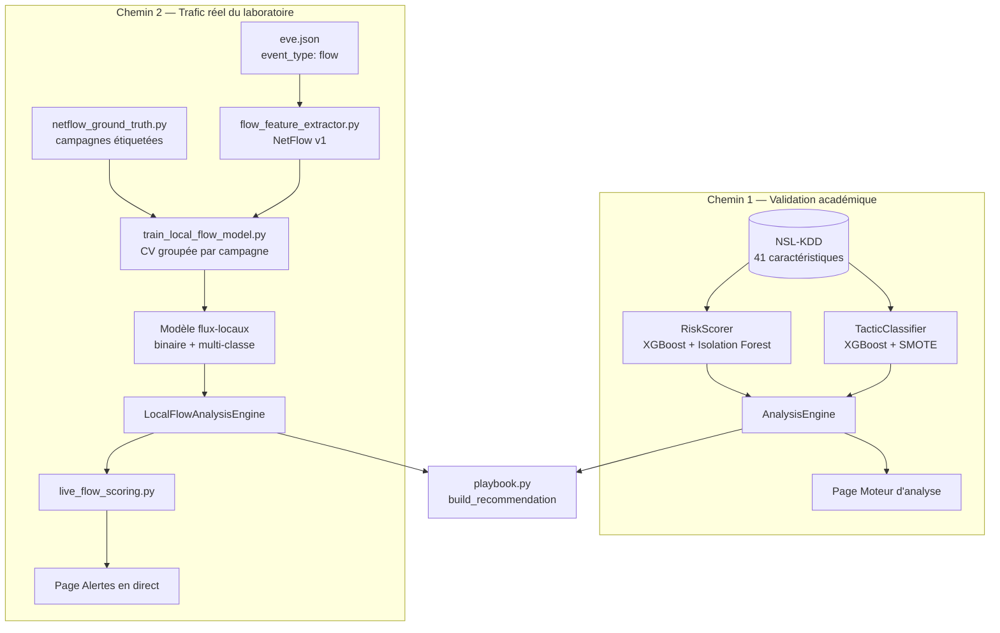
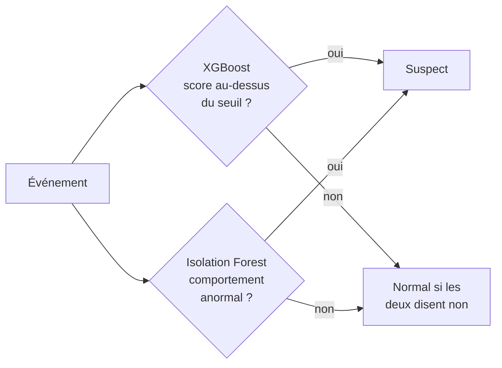
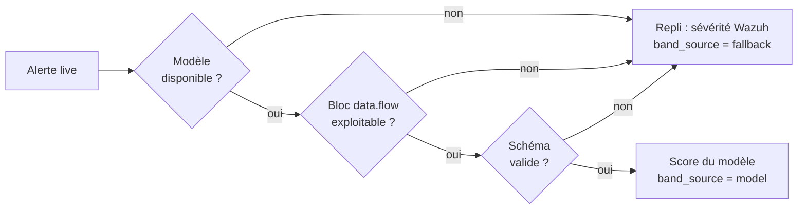
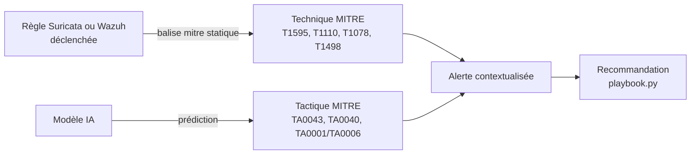
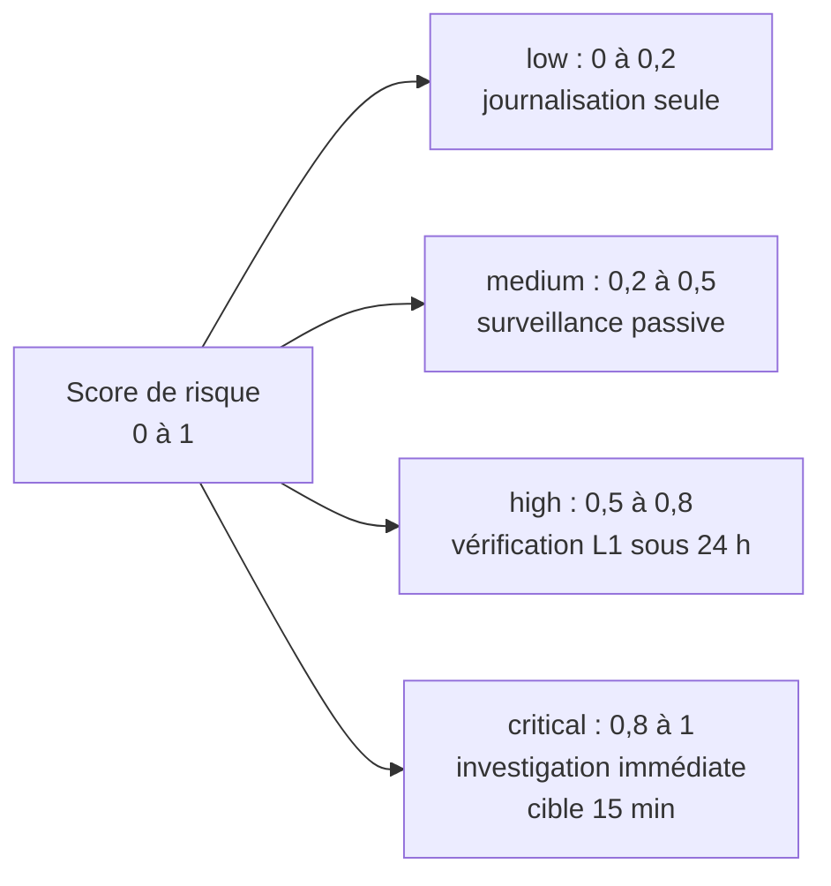
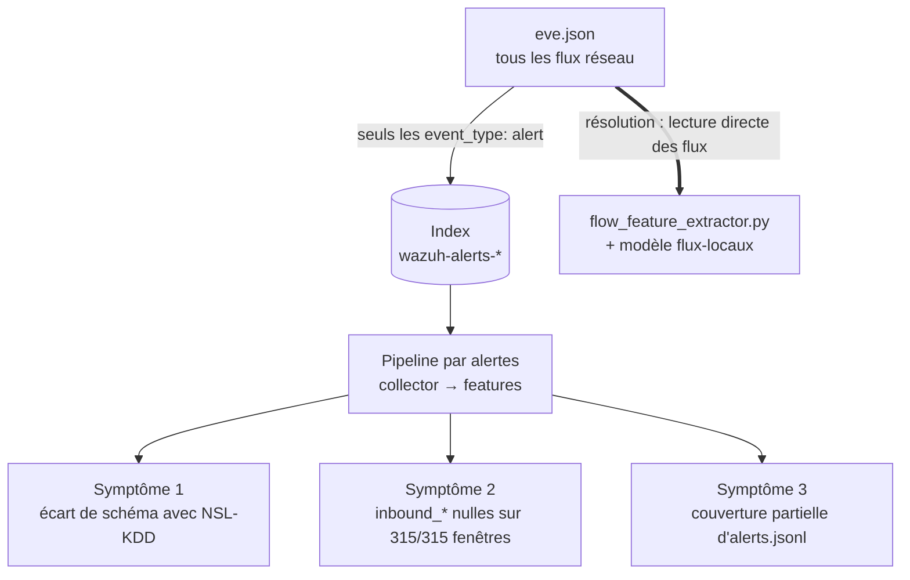

# Architecture — Moteur Intelligent de Détection d'Intrusions (AICYOU)

| | |
| --- | --- |
| **Stagiaire** | Mouhamed Aziz Derouiche |
| **Encadrant** | Dr. Alaidine Ben Ayed — Stratégie AICYOU Inc. |
| **Dépôt** | `soc-aicyou` |
| **Dernière mise à jour** | 15/09/2026 |

---

## 1. Vue d'ensemble

Environnement de lab SOC déployé sur une VM Ubuntu Server 22.04 LTS dédiée,
hébergeant une stack **Wazuh** (SIEM/HIDS) et **Suricata** (NIDS) orchestrés
via Docker Compose. Le système collecte, normalise et analyse des événements
de sécurité selon **trois couches de détection** complémentaires
(signatures, comportementale, intelligence artificielle), avec priorisation
automatique des alertes et correspondance **MITRE ATT&CK**, restituées dans
un tableau de bord Streamlit.

**Portée actuelle** (détail honnête en section 10) : les couches signatures
et comportementale sont pleinement opérationnelles et validées sur trafic
réel. La couche IA a d'abord été validée sur le jeu académique NSL-KDD ;
une tentative de transfert depuis un jeu public (NF-CSE-CIC-IDS2018) a été
écartée sur mesure le 06/09/2026 ; la résolution a ensuite été obtenue
(08-10/09/2026) par un **modèle entraîné directement sur les flux réels du
laboratoire**, désormais branché sur la page « Alertes en direct ». Trois
tactiques sur quatre sont couvertes en conditions réelles ;
PrivilegeEscalation reste hors de cette couverture.

---

## 2. Infrastructure

| Composant | Détail |
| --- | --- |
| Hôte | VM Ubuntu Server 22.04 LTS, 16 Go RAM alloués |
| Utilisateur système | `aicyou` (non-root, membre du groupe `docker`) |
| Réseau VM | Interface `ens33`, IP `192.168.1.249/24` (bridge, DHCP) |
| Orchestration | Docker Engine 29.6.2 + Docker Compose v5.3.1 |
| Pare-feu | UFW — deny incoming par défaut, exceptions ciblées |
| Simulation d'attaque | VM Windows 10 sur le même sous-réseau — nmap, Posh-SSH, flood TCP PowerShell |

---

## 3. Topologie des services

---

## 4. Sécurité — mesures appliquées

- **Aucun service en root** : utilisateur dédié `aicyou`, membre du groupe `docker`.
- **Versions épinglées** : `wazuh-docker` en submodule sur le tag `v4.9.0`,
  Suricata sur `7.0.7`. Jamais `latest`.
- **Secrets hors Git** : mots de passe dans `single-node/.env`, ignoré par un
  `.gitignore` dédié au submodule ; template `.env.example` fourni.
- **Identifiants régénérés** : remplacement des comptes par défaut par des
  secrets `openssl rand -base64 24`, empreintes bcrypt recalculées.
- **Pare-feu** : UFW deny-by-default, port 443 restreint à `192.168.1.0/24`.
- **Moindre privilège** : le pipeline utilise le compte `pipeline_svc`, en
  lecture seule sur `wazuh-alerts-*` uniquement.
- **Fork du submodule Wazuh** (15/08/2026) : le submodule pointait sur le
  dépôt officiel en lecture seule ; les commits locaux (règles, durcissement)
  n'avaient jamais été poussés. Corrigé par un fork personnel, vérifié par
  clone frais.

**Limites de sécurité connues** : `wazuh.yml` (dashboard → API) ne supporte
pas les variables d'environnement, le mot de passe API y figure en clair ;
le dashboard Streamlit n'a pas d'authentification (acceptable pour un lab
isolé, à traiter avant toute production — conformité Loi 25).

---

## 5. Pipeline de traitement

| Module | Rôle |
| --- | --- |
| `wazuh_client.py` | Client de l'Indexer, compte de service en lecture seule |
| `normalizer.py` | Unifie les schémas Wazuh/Suricata ; conserve les champs niveau flux (`flow_src_ip`) en plus du niveau paquet (`src_ip`) |
| `collector.py` | Collecte incrémentale par point de reprise, stockage JSON Lines |
| `feature_extractor.py` | Agrégats par fenêtre glissante : 16 colonnes dont 2 identifiants et 14 caractéristiques — **11 réellement exploitables** (les 3 `inbound_*` sont structurellement nulles, voir section 10) |
| `feature_schema.py` | Contrat de schéma explicite : trois schémas reconnus (NSL-KDD, agrégats d'alertes, flux locaux) |

---

## 6. Détection en profondeur — trois couches

### Couche 1 — Signatures

Ruleset natif Suricata (40 000+ règles) : menaces connues (CVE, malware,
exploits).

### Couche 2 — Comportementale (indépendante de l'outil)

Règles fondées sur des patterns de comportement plutôt que sur des
signatures d'outil : elles fonctionnent contre n'importe quel outil
produisant le même trafic.

| Règle | Moteur | Détection | Seuil / niveau | MITRE | Statut |
| --- | --- | --- | --- | --- | --- |
| 9000001 | Suricata | Scan de ports rapide | 15 SYN / 10 s | T1595 | ✅ Validé live |
| 9000002 | Suricata | Scan lent (low-and-slow) | 10 SYN / 60 s | T1595 | ✅ Validé live |
| 9000003 | Suricata | Flood volumétrique (DoS) | 50 SYN / 10 s | T1498 | ✅ Validé live |
| 100010 | Wazuh | Échecs SSH répétés | 3 échecs / 120 s, niveau 10 | T1110 | ✅ Validé live (14/09) |
| 100011 | Wazuh | Succès après échecs | niveau 14 | T1110, T1078 | ✅ Validé live |
| 100012 / 100013 | Wazuh | Escalade de sévérité des scans | niveau 8 | T1595 | ✅ Ajoutées 15/08 |
| 100014 | Wazuh | Escalade de sévérité du flood | niveau 12 | T1498 | ✅ Ajoutée 15/08 |

> **Limite connue** : la directive `threshold` de Suricata ne compte pas les
> ports *distincts*. Un flood mono-port déclenche donc aussi les règles de
> scan. Comportement attendu et documenté.

---

## 7. Couche 3 — Moteur d'intelligence artificielle

Le moteur a été construit en **deux chemins**, correspondant aux deux étapes
du projet : une validation académique, puis un modèle opérationnel sur
trafic réel.

### Chemin 1 — Validation sur NSL-KDD

Le score de risque combine un modèle supervisé et un détecteur d'anomalies
non supervisé en **logique OU** :

| Métrique | XGBoost seul | Ensemble |
| --- | --- | --- |
| Taux de détection (rappel) | 70,0 % | 77,5 % |
| Taux de faux positifs | 2,99 % | 3,58 % |

Classifieur de tactique (couverture étendue à 39/39 types d'attaque) :
exactitude de généralisation **83,2 %** — F1 : Impact 0,93 ;
Reconnaissance 0,70 ; InitialAccess_CredentialAccess 0,75 ;
PrivilegeEscalation 0,19 (traitée en priorité manuelle systématique).

### Chemin 2 — Modèle entraîné sur trafic réel

| Module | Rôle |
| --- | --- |
| `flow_feature_extractor.py` | Extrait les caractéristiques NetFlow v1 des enregistrements de flux de `eve.json` |
| `netflow_ground_truth.py` | Étiquette les flux par campagnes horodatées ; identifiant de campagne (tactique, source, jour) |
| `run_attack_campaign.py` | Orchestration des campagnes : modes `plan`, `record`, `verify` |
| `train_local_flow_model.py` | Entraîne les modèles binaire et multi-classe, validation groupée **et** naïve mesurées côte à côte |
| `live_flow_scoring.py` | Reconstruit les caractéristiques depuis les alertes live et score en temps réel |

| Classe | Flux | Campagnes |
| --- | --- | --- |
| Benign | 8 769 | 4 |
| Reconnaissance | 11 183 | 3 |
| Impact (DoS) | 1 200 | 3 |
| InitialAccess / CredentialAccess | 96 | 3 |

Validation **groupée par campagne** (aucune campagne à la fois en
entraînement et en test) : binaire F1 macro **0,99**. L'écart faible entre
validation groupée et naïve indique que le modèle généralise au lieu
d'apprendre les campagnes par cœur.

### Scoring live avec repli explicite

Mesuré sur un échantillon de 300 alertes : **87 scorées par le modèle**,
213 en repli. Le repli n'est jamais silencieux : chaque ligne porte sa
source, et un bandeau du dashboard affiche la répartition.

---

## 8. Correspondance MITRE ATT&CK — deux mécanismes

| Mécanisme | Portée | Statut |
| --- | --- | --- |
| Basé sur les règles (tag MITRE dans `local_rules.xml`) | Types d'attaque couverts par une règle : scan, brute-force SSH, flood | ✅ Live, automatique — `mitre.id` renseigné dès le déclenchement (vérifié par `wazuh-logtest`) |
| Basé sur l'IA (prédiction de tactique) | Comportements suspects au-delà des signatures | ✅ Live pour 3 tactiques via le modèle flux-locaux ; PrivilegeEscalation validée sur NSL-KDD uniquement |

Les deux mécanismes répondent à l'objectif du cahier des charges avec des
garanties de fiabilité différentes, présentées comme telles.

---

## 9. Priorisation — bandes de risque

Procédures détaillées par tactique : `docs/playbook-reponse-incidents.md`.

---

## 10. Limites connues (transparence)

Cette section liste les limites identifiées par des tests, plutôt que
supposées absentes.

### Cause racine commune : le pipeline par alertes lit des alertes, pas des flux

Wazuh n'indexe que les événements Suricata de type `alert`. Tout flux qui
n'a déclenché aucune règle est invisible pour le pipeline par alertes. Le
trafic entrant existe pourtant dans `eve.json` (8 684 flux TCP entrants sur
la seule fenêtre du scan du 31/08). Le chemin 2 (section 7) lit ces flux
directement.

### Échec mesuré du transfert depuis un jeu public (06/09/2026)

Modèle entraîné sur NF-CSE-CIC-IDS2018 (8,4 M de flux) puis appliqué au
trafic local : **0 attaque détectée sur 10 440**, AUC-ROC **0,1604** —
anti-corrélation systématique. Polarité d'étiquettes vérifiée
(`is_polarity_bug: false`), chemin d'inférence vérifié (rappel 1,0 côté
source). Mécanisme : les caractéristiques dominantes (`OUT_PKTS`,
`L4_DST_PORT`) décrivent le banc d'essai source ; 85,7 % du trafic bénin
local circule sur des ports vus comme « d'attaque » à l'entraînement. Voie
écartée sur preuve, remplacée par le chemin 2.

### Limites du modèle entraîné sur trafic réel

- Jeu de taille réduite et environnement de laboratoire aux signatures
  d'attaque nettement séparées : les scores élevés reflètent en partie cette
  séparabilité.
- Nombre de campagnes limité (3 par classe d'attaque), qui borne le nombre
  de plis de la validation groupée.
- Classe InitialAccess / CredentialAccess : 96 flux seulement.
- PrivilegeEscalation absente du jeu local (aucune campagne réelle).
- En live, `TCP_FLAGS` et `FLOW_DURATION` sont absents des alertes indexées
  et forcés à 0 (≈ 1,1 % de l'importance du modèle binaire).
- 87 alertes sur 300 seulement sont scorées par le modèle ; les autres ne
  portent pas de bloc de flux exploitable.

### Autres limites

- **Désambiguïsation scan / flood** non native dans Suricata (section 6).
- **Collecte `alerts.jsonl` manuelle** : `collector.py` tire 500 alertes par
  exécution, ce n'est pas un service continu.
- **Pas d'automatisation SOAR** ni de notification (email, webhook) : les
  SLA du playbook ne sont pas garantis automatiquement.
- **Trafic chiffré** : visibilité limitée aux métadonnées (SNI, JA3).
- **Dashboard sans authentification** et **pas de politique de rétention**
  des données (conformité Loi 25 non encore traitée).
- **Extra Trees** du chemin NetFlow entraîné sur un sous-échantillon
  (1 M de lignes) par contrainte de RAM.
- **Latence bout-en-bout** mesurée sur un seul run de 200 alertes.

---

## 11. Décisions techniques notables

| Décision | Justification |
| --- | --- |
| Submodule Git épinglé sur un tag | Un tag est immuable ; une branche peut évoluer et casser la reproductibilité |
| Fork personnel du submodule Wazuh | Le dépôt officiel est en lecture seule : sans fork, les commits ne sont pas récupérables |
| `.env` séparé + `.env.example` | Sépare configuration et code, aucun secret dans Git |
| Suricata en `network_mode: host` | Requis pour capturer les paquets bruts sur l'interface physique |
| Ensemble XGBoost + Isolation Forest (OU) | Le supervisé plafonne sur les attaques inconnues ; le non supervisé compense |
| Contrat de schéma explicite | Un crash cryptique ou une prédiction silencieuse devient un diagnostic actionnable |
| Porte de décision chiffrée inscrite dans le code avant mesure | Un critère fixé après coup s'ajuste au résultat |
| Adresses IP exclues des caractéristiques des modèles | Sinon le modèle mémorise le plan d'adressage au lieu d'un comportement |
| Vérité terrain externe aux caractéristiques (auth.log, journal de bord) | Évite un étiquetage circulaire |
| Validation croisée groupée par campagne | Des flux d'une même campagne sont corrélés : un découpage aléatoire gonfle les scores |
| Repli explicite et traçable (`band_source`) | Un score IA absent ne doit jamais passer pour un score IA |

---

## 12. Prochaines étapes

1. **PrivilegeEscalation réelle** : règle Wazuh dédiée (modification de
   `sudoers`, binaires SUID — T1548) validée par une action réelle, puis
   campagnes pour le modèle.
2. **Plus de campagnes distinctes** (sources et jours variés) pour augmenter
   le nombre de plis de la validation groupée.
3. **Scoring live sur les flux** plutôt que sur les alertes indexées, pour
   récupérer `TCP_FLAGS` et la durée et scorer davantage que 87/300 alertes.
4. **Conformité Loi 25** : authentification du dashboard, politique de
   rétention des données.
5. **Collecte continue** (service systemd) et **notifications** pour
   rendre les SLA applicables.
6. **Réponse semi-automatique** (blocage IP, isolement d'hôte) sous
   supervision d'un analyste.

---

*Documents liés* : `docs/journal-technique.md` (historique des incidents),
`docs/guide-installation.md` (déploiement pas à pas),
`docs/playbook-reponse-incidents.md` (procédures de réponse).
